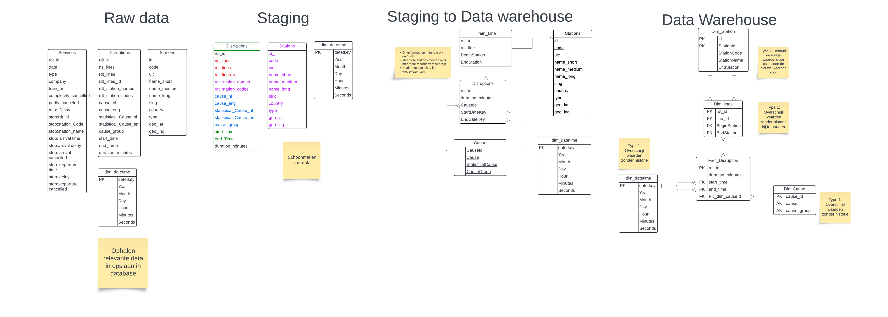
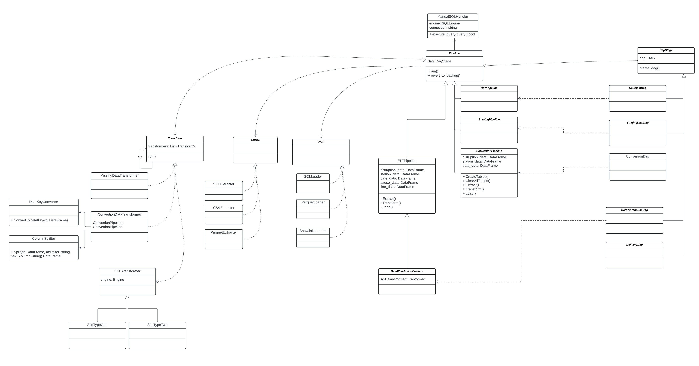
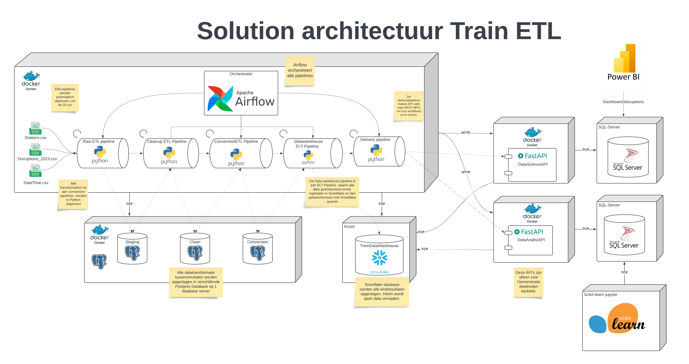

# Technical Documentation
This file will explain the modeling, solution and software architecture of the TrainETL project. In the first part, it will explain the ERD-Diagram of each step: from extraction raw data to the storage of data within a datawarehouse in Snowflake.

In the next part, the solution architecture will explained. Like the technologies used within this project, how all of these systems are hosted and interact with eachother. The goal is to explain the logic behind all of these choices.

## Entity-Relationship Diagram (ERD)

### Raw ERD.
This section outlines the first stage of data ingestion:

**Objective**: Centralize all data in a single location.

**Process:**
Extract data from CSV files.
- Store extracted data directly in Postgres databases.
- No data manipulation or transformation will be performed at this stage.
**Outcome:**
- All data will be readily available in a centralized location (Postgres database) for further processing in subsequent stages.

### Cleanup
The cleanup stage is crucial for ensuring data quality and consistency. In this stage, data is extracted from the raw database and undergoes various cleaning processes to remove any inconsistencies, duplicates, and errors. The cleaned data is then stored in the staging database. This stage ensures that only high-quality data is passed on to the next stages of the ETL process, facilitating accurate and reliable analysis.

**Process:**
- Extract data from the raw database.
- Perform data cleaning operations such as removing duplicates, correcting errors, and standardizing formats.
- Store the cleaned data in the staging database.

**Outcome:**
- High-quality, cleaned data is available in the staging database for further processing and transformation.
- Ensures data consistency and reliability for subsequent stages.

### Conversion
The conversion stage is responsible for transforming the cleaned data into a format suitable for storage in the data warehouse. This involves organizing the data into a star schema and normalizing it to ensure consistency and efficiency.

**Process:**
- Transform cleaned data into a star schema.
- Normalize the data to eliminate redundancy and improve data integrity.
- Prepare the data for transfer to the data warehouse.

**Outcome:**
- Data is structured in a star schema, facilitating efficient querying and analysis.
- Normalized data ensures consistency and reduces redundancy.
- Data is ready for transfer to the data warehouse for long-term storage and analysis.

### Data Warehouse

The data warehouse serves as the single source of truth for the TrainETL project. Key characteristics and processes include:

- **Data Retention**: No data will be deleted from the data warehouse, ensuring comprehensive historical records.
- **Slowly Changing Dimensions (SCD)**: Type 1 slowly changing dimensions are applied to the dimension tables. This approach is chosen due to the lack of necessity for maintaining historical data.

**Outcome:**
- The data warehouse provides a reliable and consistent source of truth for all data analysis and reporting needs.
- The use of Type 1 SCD ensures that the most current data is always available without maintaining historical versions.
## Class diagram

This is the class diagram of the system.

## Solution Architecture

The TrainETL project employs a distributed architecture with the following components:

- **Airflow**: Hosted as a separate service.
- **Databases**: Deployed on individual services.
- **APIs**: Managed on their own services.

**Reasons for Distributed Architecture**:
- Better organizational fit due to the decentralized nature of the company.
- Increased availability.
- Enhanced resilience to errors in individual services.

### Airflow Pipelines

Airflow pipelines are hosted in a monolithic architecture.

**Reasons for Monolithic Architecture**:
- Simplifies testing.
- Reduces latencies.
- The small scope of the project necessitates a simpler architecture.

### Tech Stack

- **Python**: Chosen for its ease of use and consistency with other services like full-stack development and data science/data engineering. Required by Airflow.
- **Airflow**: Industry-standard orchestrator with excellent documentation and scalability. Compatible with various cloud services like AWS and Google Cloud.
- **Postgres**: A performant SQL database with great support, suitable for general-purpose use.
- **Snowflake**: Ideal for data insertion and analytics, functioning as the data warehouse.
